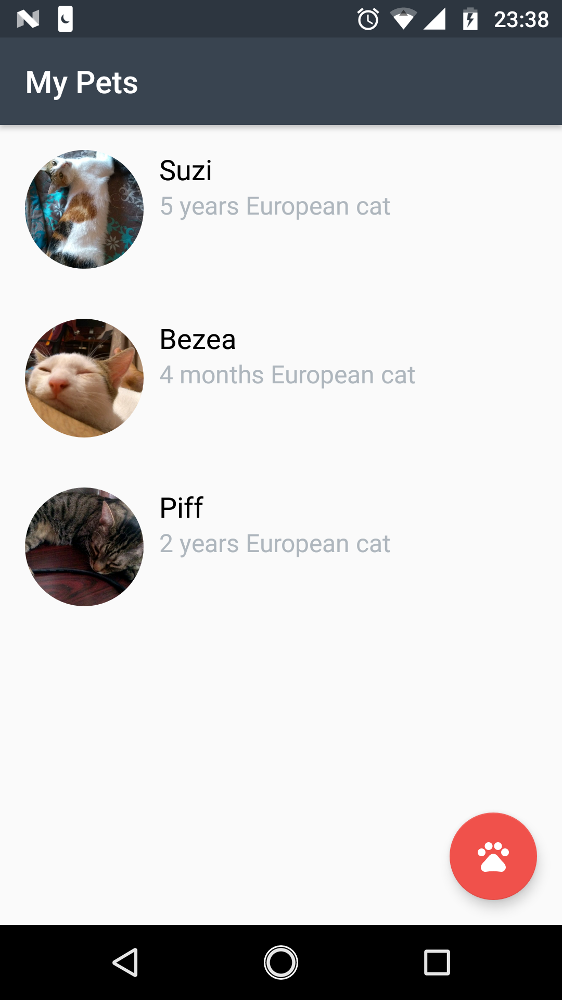
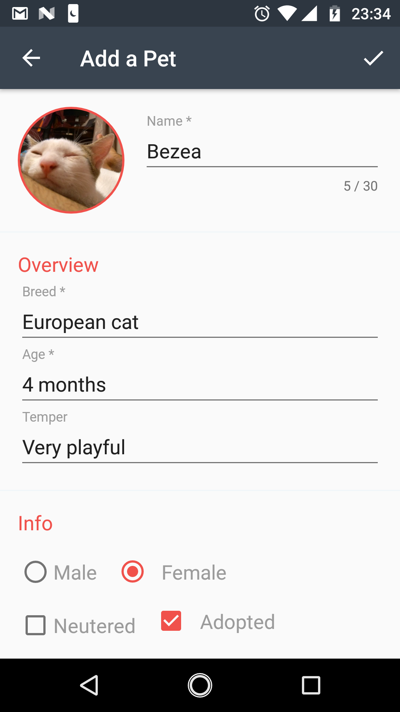
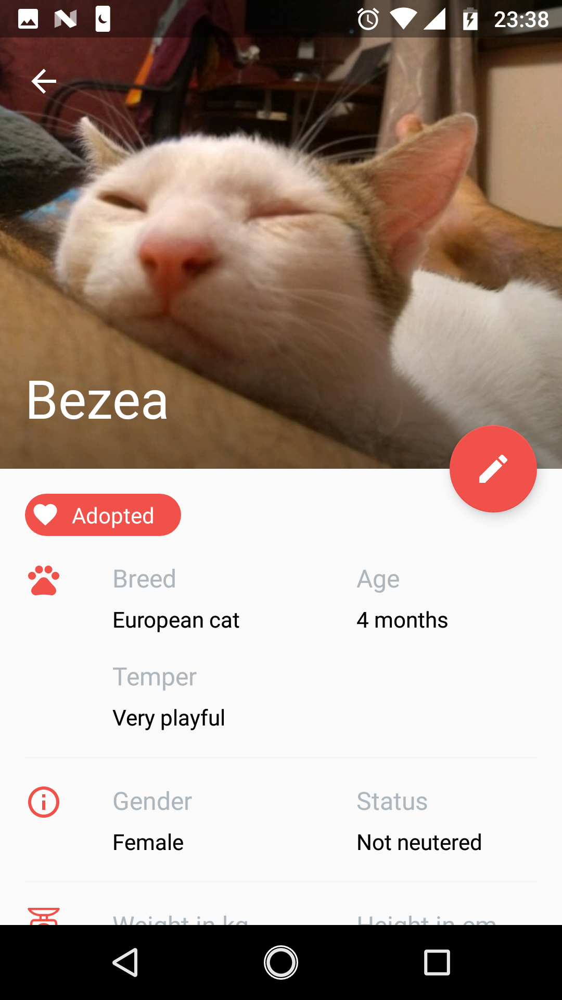
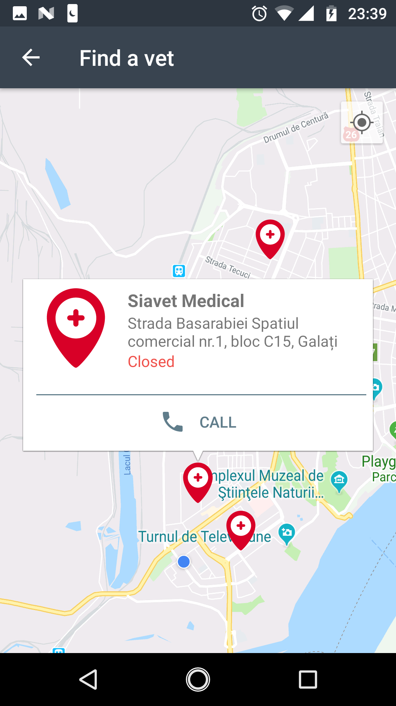

# PetCare

PetCare was implemented as final project for Android Developer Nanodegree Program from Udacity, for educational purpose only. The app has the following functionality:

* Display a list of user pets using RecyclerView 
* Possibility to select a pet item by tapping and view more details
* Possibility to add a new pet in the list with detailed information and picture
* Possibility to edit/delete an existing pet
* Function to view nearby veterinary offices and possibility to call in order to make an appointment

In order to test the app, one needs to get an API Key for Google Maps API and Google Places API and define it in local gradle.properties file as PetCare_GoogleMapsApiKey = "YOUR_API_KEY".

